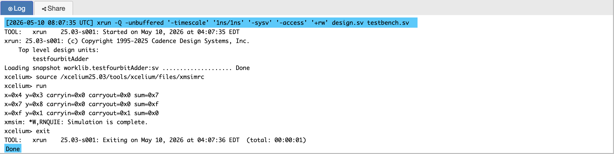
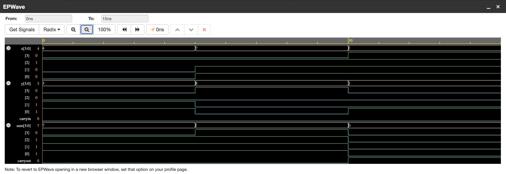

# P01 — 4-Bit Ripple Carry Adder in Verilog

A behavioral RTL implementation of a 4-bit binary adder
with carry output, written in Verilog and simulated on
EDA Playground using Cadence Xcelium.

---

## What It Does

This module takes two 4-bit binary numbers as inputs
(x and y and carry input) and produces a 4-bit sum and a 1-bit carry
output. When the addition result exceeds 15 — the
maximum value a 4-bit number can hold — the carry bit
is set to 1, indicating overflow into a fifth bit.

---

## Block Diagram

### 4-Bit Ripple Carry Adder

```text
       A3 B3       A2 B2       A1 B1       A0 B0
       |  |        |  |        |  |        |  |
       V  V        V  V        V  V        V  V
    +-------+   +-------+   +-------+   +-------+
Cout|       |   |       |   |       |   |       |
<---|  FA3  |<--|  FA2  |<--|  FA1  |<--|  FA0  |<--- Cin
    |       | C3|       | C2|       | C1|       |
    +-------+   +-------+   +-------+   +-------+
        |           |           |           |
        V           V           V           V
        S3          S2          S1          S0
```
---

## How It Works

The design uses a single behavioral `always @(*)` block,
which means the output updates immediately whenever any
input changes — this is correct for combinational logic
that has no clock. The concatenation `{carryout, sum} = x + y + carryin`
is the key line: by making the left-hand side 5 bits wide
(1 carry + 4 sum), Verilog automatically captures the
fifth bit of the addition result as the carry output.
The testbench verifies five cases including the corner
cases of 0+0 (minimum) and 15+15 (maximum with carry).

---

## Simulation Output



---

## EPWave Waveform



---

## Test Cases

| x (Decimal) | y (Decimal) | carryin | Binary x | Binary y | Expected Sum | carryout |
|-------------|-------------|-----|----------|----------|--------------|---------------|
| 4           | 3           | 0   | 0100     | 0011     | 0111 (7)     | 0             |
| 6           | 8           | 1   | 0110     | 1000     | 1111 (15)    | 0             |
| 15          | 0           | 1   | 1111     | 0000     | 0000 (0)     | 1             |
| 15          | 15          | 1   | 1111     | 1111     | 1111 (15)    | 1             |

### Detailed Logic Breakdown

1. Case (4 + 3), Cin = 0:
The binary addition is 0100 + 0011. There are no carries generated between stages. The result is 0111, which equals 7 in decimal.

2. Case (6 + 8), Cin = 1:
The binary addition is 0110 + 1000 + 1. The carry-in at the first stage results in a sum of 15 (1111). No final carry-out is generated.

3. Case (15 + 0), Cin = 1:
The binary addition is 1111 + 0000 + 1. The carry-in ripples through every single full adder stage, effectively acting as 15 + 1. This results in a sum of 0000 and sets the Cout bit to 1.

4. Case (15 + 15), Cin = 1:
This is the maximum possible value for a 4-bit adder with Cin. Mathematically, 15 + 15 + 1 = 31. In 4-bit binary, 31 is represented as a Cout of 1 and a Sum of 1111 (16 + 15).

---

## Files

- `four_bit_adder.v` — RTL design module
- `testbench.v` — Testbench with 4 test cases

---

## Tools Used

- EDA Playground — online Verilog simulator
- Cadence Xcelium — simulation engine
- EPWave — waveform viewer

---

## What I Learned

Before this project I did not understand why `always @(*)`
is used instead of `assign` for combinational logic. I
learned that both produce the same hardware after synthesis,
but `always @(*)` is preferred when the logic involves
multiple conditions or lines. I also learned that the `+`
operator in Verilog handles carry automatically, whereas
using `^` (XOR) would require me to manually compute carry
for each bit, which is the underlying gate-level operation
that `+` abstracts away.
