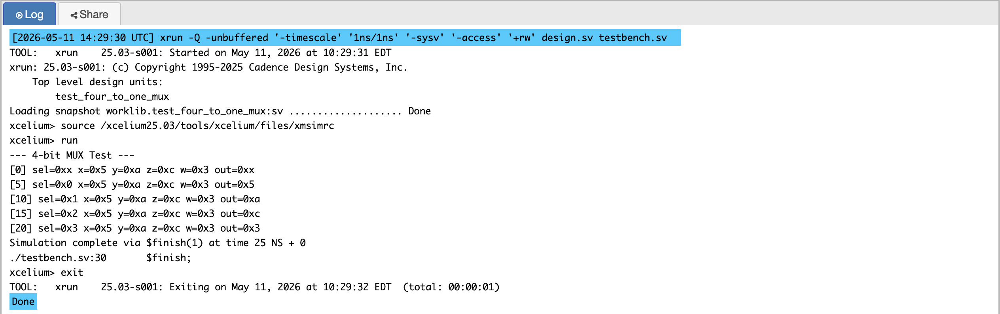
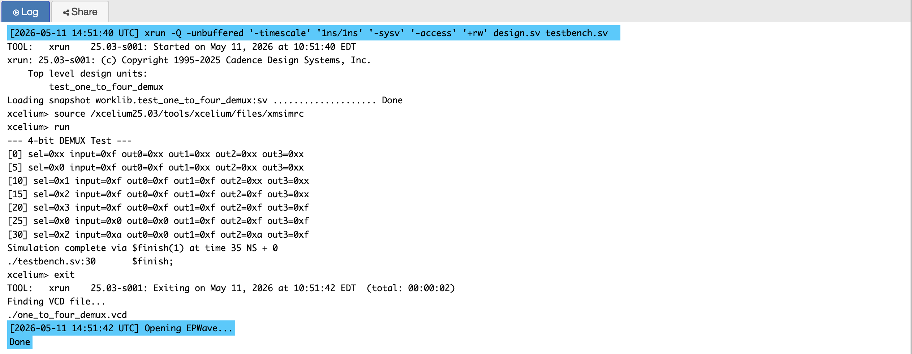
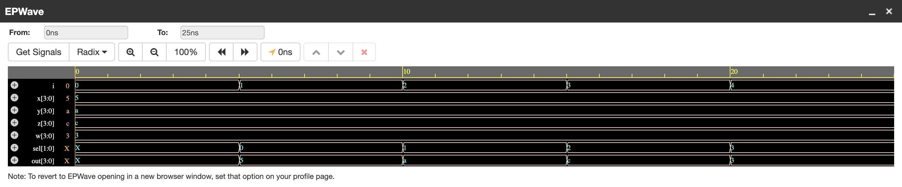
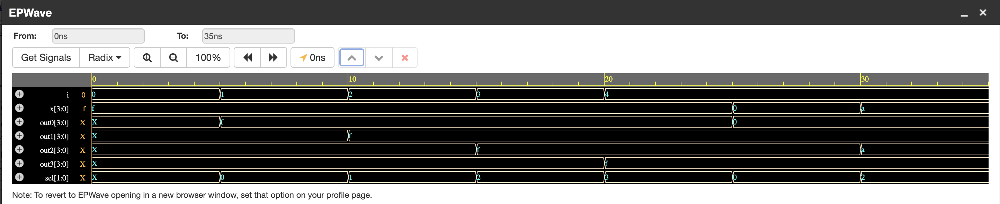

# P02 — 4-bit 4-to-1 Multiplexer and 1-to-4 Demultiplexer

Behavioral RTL implementation of a 4-bit 4-to-1 MUX and
a 4-bit 1-to-4 DEMUX in Verilog, simulated on EDA Playground
using Cadence Xcelium. Both designs use `always @(*)` with
a `case` statement for clean, synthesizable combinational logic.

---

## What They Do

### Multiplexer (MUX)
A 4-to-1 MUX selects one of four 4-bit input numbers
and routes it to the output based on a 2-bit select signal.

```
Inputs  : x, y, z, w  — four 4-bit numbers
Select  : sel [1:0]    — 2-bit selection signal
Output  : out [3:0]    — selected 4-bit number

sel = 00 → out = x
sel = 01 → out = y
sel = 10 → out = z
sel = 11 → out = w
```

### Demultiplexer (DEMUX)
A 1-to-4 DEMUX routes a single 4-bit input to one of
four outputs based on a 2-bit select signal.
All unselected outputs remain zero.

```
Input   : x     [3:0]  — single 4-bit input
Select  : sel   [1:0]  — 2-bit selection signal
Outputs : out0, out1, out2, out3 — four 4-bit outputs

sel = 00 → out0 = x, out1/out2/out3 = 0
sel = 01 → out1 = x, out0/out2/out3 = 0
sel = 10 → out2 = x, out0/out1/out3 = 0
sel = 11 → out3 = x, out0/out1/out2 = 0
```

---

## Block Diagram

```
         ┌─────────────┐
  x ────►│             │
  y ────►│  4-to-1 MUX │────► out
  z ────►│             │
  w ────►└─────────────┘
             ▲
            sel [1:0]


         ┌──────────────┐
         │              ├────► out0
  x ────►│  1-to-4 DEMUX├────► out1
         │              ├────► out2
         └──────────────┘────► out3
             ▲
            sel [1:0]
```

---

## How It Works

Both designs use a `case` statement inside an `always @(*)`
block. The `always @(*)` sensitivity list automatically
includes all inputs — this is preferred over manually listing
signals like `always @(x or sel)` because it prevents
accidental omissions when inputs are added later.

The `case` statement evaluates `sel` and executes exactly
one branch. For the MUX, the selected input is routed to
the output. For the DEMUX, the input is routed to the
selected output while all others receive zero. It requires
a `default` branch in every case statement to prevent
latch inference during synthesis on some tools.

---

## Simulation Output

### MUX



### DEMUX



---

## EPWave Waveform

### MUX



### DEMUX



---

## Test Cases

### MUX Test Cases

| sel | x    | y    | z    | w    | Expected Output |
|-----|------|------|------|------|-----------------|
| 00  | 0101 | 1010 | 1100 | 0011 | 0101            |
| 01  | 0101 | 1010 | 1100 | 0011 | 1010            |
| 10  | 0101 | 1010 | 1100 | 0011 | 1100            |
| 11  | 0101 | 1010 | 1100 | 0011 | 0011            |

Each input is assigned a unique bit pattern so that if
`sel` accidentally routes the wrong input, the output
mismatch is immediately visible.

### DEMUX Test Cases

| x    | sel | out0 | out1 | out2 | out3 |
|------|-----|------|------|------|------|
| 1111 | 00  | 1111 | 0000 | 0000 | 0000 |
| 1111 | 01  | 0000 | 1111 | 0000 | 0000 |
| 1111 | 10  | 0000 | 0000 | 1111 | 0000 |
| 1111 | 11  | 0000 | 0000 | 0000 | 1111 |
| 0000 | 00  | 0000 | 0000 | 0000 | 0000 |
| 1010 | 10  | 0000 | 0000 | 1010 | 0000 |

The DEMUX testbench uses `$monitor` which prints
automatically whenever any signal changes — this captures
all transitions without manual `$display` calls at each step.

---

## Files

| File | Description |
|------|-------------|
| `mux_four_to_one.v` | RTL design — 4-to-1 MUX |
| `testbench_mux_four_to_one.v` | Testbench for MUX |
| `demux_one_to_four.v` | RTL design — 1-to-4 DEMUX |
| `testbench_demux_one_to_four.v` | Testbench for DEMUX |
| `simulation_output_mux.png` | Console simulation output for MUX test |
| `simulation_output_demux.png` | Console simulation output for DEMUX test |
| `epwave_waveform_mux.png` | EPWave waveform for MUX test |
| `epwave_waveform_demux.png` | EPWave waveform for DEMUX test |

---

## Tools Used

- EDA Playground — online HDL simulator
- Cadence Xcelium — simulation engine
- EPWave — waveform viewer

---

## What I Learned

- The `case` statement evaluates exactly one branch and
  is the correct construct for multiplexer-style logic
  where one condition maps to one action.
- `always @(*)` is safer than manually listing sensitivity
  signals because it auto-captures all inputs.
- For a DEMUX, it is not enough to verify the selected
  output — all unselected outputs must be verified as zero
  in every test case, because a common bug is the input
  leaking to an unselected output.
- `$monitor` in a testbench automatically prints whenever
  any monitored signal changes, unlike `$display` which
  prints only when explicitly called.
- A `default` case must be added to every `case` statement
  to prevent latch inference during synthesis.

---
