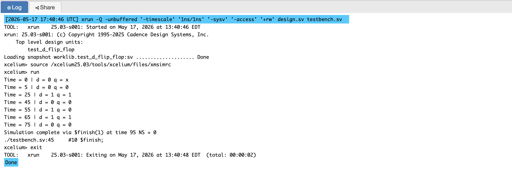
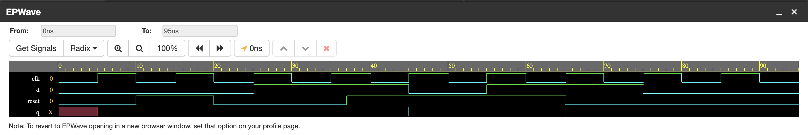
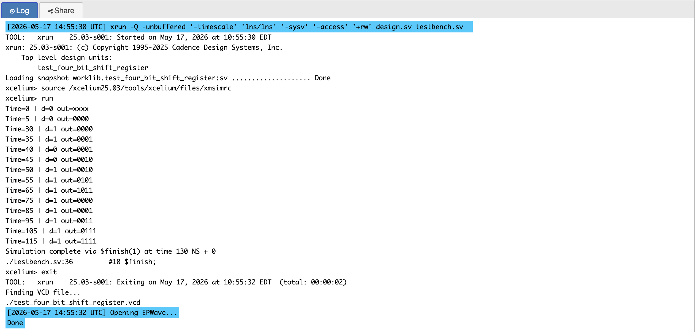
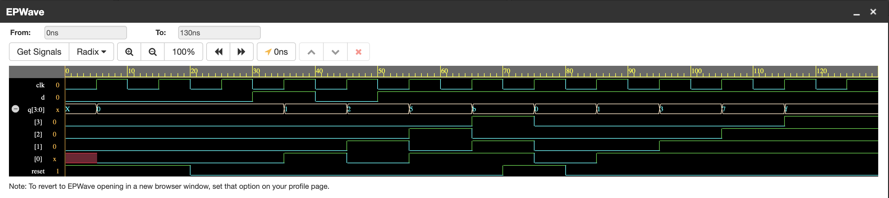

# P03 — D Flip-Flop and 4-Bit SIPO Shift Register

Sequential logic circuits that store and move data using a clock signal.
Both designs use synchronous active-high reset and are implemented
in Verilog using the industry-standard `always @(posedge clk)` style.

---

## What This Project Contains

This project has two separate but deeply connected circuits. The D flip-flop
is the fundamental building block of all sequential digital design — it stores
exactly one bit of data and updates only on the rising edge of a clock.
The 4-bit SIPO (Serial In Parallel Out) shift register is built from four
D flip-flops connected in a chain, where each flip-flop feeds its output
into the next one. Serial data enters one bit per clock cycle, and all four
stored bits are visible simultaneously on the parallel output.

---

## Circuit 1 — D Flip-Flop

### How It Works

The D flip-flop captures the value of its input `d` on every rising edge
of the clock and holds it at output `q` until the next rising edge.
The synchronous reset clears the output to zero on the next clock edge
when `reset` is high, regardless of what `d` holds at that moment.
This is called synchronous because the reset only takes effect when
the clock edge arrives — it does not respond to reset changes in between
clock edges. This makes timing analysis predictable and is why
synchronous reset is the industry standard in VLSI design.

```
Behaviour:
On posedge clk:
  if reset = 1  →  q = 0   (clear output)
  if reset = 0  →  q = d   (capture input)
```

### Block Diagram

```
        +------------------+
   d ──►│                  │
        │   D Flip-Flop    ├──► q
 clk ──►│  (sync reset)    │
reset──►│                  │
        +------------------+
```

### Simulation Output



### EPWave Waveform



### Test Cases 

The testbench verifies five important scenarios.  
First, the initial state is tested by starting with reset low and d low to confirm the output
begins at a known value.  
Second, active-high synchronous reset is confirmed
by asserting reset high and verifying q goes to zero on the next clock edge.  
Third, normal data capture is verified by driving d high after reset is
deasserted and confirming q follows.   
Fourth, reset mid-operation is tested
by asserting reset while d is high — this confirms the flip-flop correctly
overrides the data input with the reset signal.  
Fifth, normal operation
after reset release is confirmed to ensure the flip-flop resumes capturing
data correctly after reset is brought low again.

---

## Circuit 2 — 4-Bit SIPO Shift Register

### How It Works

SIPO stands for Serial In Parallel Out. One bit of data enters through
the serial input `d` on each rising clock edge. Inside the design, the
concatenation operation `{q[2:0], d}` shifts the existing three bits
one position to the left and inserts the new bit at the rightmost position.
After four clock cycles, the four most recently received bits are all
visible simultaneously on the 4-bit parallel output `q`. This is exactly
the mechanism that a UART receiver uses to collect serial bits and
present them as a parallel byte to the processor.

```
Behaviour:
On posedge clk:
  if reset = 1  →  q = 0000        (clear all bits)
  if reset = 0  →  q = {q[2:0], d} (shift left, insert d at bit 0)

Example — shifting in the pattern 1, 0, 1, 1:
  After clock 1:  q = 0001
  After clock 2:  q = 0010
  After clock 3:  q = 0101
  After clock 4:  q = 1011
```

### Block Diagram

```
        +------------------------------------------+
        |          4-Bit SIPO Shift Register        |
        |                                           |
   d ──►│ [FF3] ◄── [FF2] ◄── [FF1] ◄── [FF0] ◄─d │
        |   q[3]     q[2]     q[1]     q[0]        │
 clk ──►│                                           │
reset──►│                                           │
        +──q[3]──────q[2]──────q[1]──────q[0]──────+
                 Parallel Output q[3:0]
```

### Simulation Output



### EPWave Waveform



### Test Cases 

The testbench verifies three meaningful scenarios.  
The first shifts in the pattern 1, 0, 1, 1 to produce parallel output 1011 — the same
sequence the FSM sequence detector in Project 5 is designed to find,
connecting these two projects conceptually.  
The second tests synchronous reset mid-operation by asserting reset while the shift register holds data,
confirming q clears to 0000 on the next clock edge. The third shifts in
four consecutive 1s to verify the all-ones boundary condition.

---

## Files

| File | Description |
|------|-------------|
| `d_flip_flop.v` | RTL design — 1-bit D flip-flop with synchronous reset |
| `test_d_flip_flop.v` | Testbench for D flip-flop |
| `four_bit_shift_register.v` | RTL design — 4-bit SIPO shift register |
| `test_four_bit_shift_register.v` | Testbench for SIPO shift register |
| `simulation_output_flip_flop.png` | Console simulation output for D flip-flop test |
| `simulation_output_register.png` | Console simulation output for SIPO shift register test |
| `epwave_waveform_flip_flop.png` | EPWave waveform for D flip-flop test |
| `epwave_waveform_register.png` | EPWave waveform for SIPO shift register test |

---

## Tools Used

- EDA Playground — online Verilog/SystemVerilog simulator
- Cadence Xcelium — simulation engine
- EPWave — waveform viewer

---

## What I Learned

Three fundamental hardware concepts become concrete through this project.
The `posedge clk` sensitivity means sequential circuits only respond
to the rising clock edge, making digital systems predictable and timing-safe.
Synchronous reset ensures the circuit has no timing violations from
asynchronous signal changes, which is why it is the industry standard.
Verilog concatenation `{q[2:0], d}` creates a new value by joining signals
end to end — the most elegant and synthesizable way to express shift
register behavior in RTL code.
