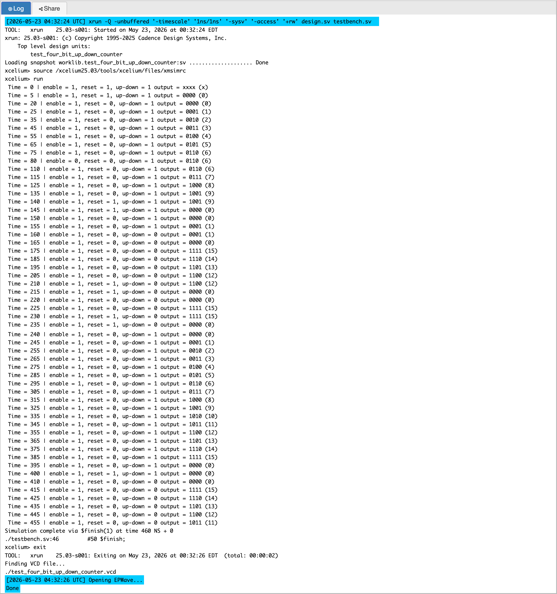
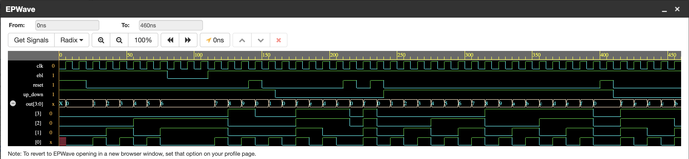

# P04 — 4-Bit Up/Down Counter with Enable and Synchronous Reset

A sequential logic circuit that counts upward or downward on every
rising clock edge. The design uses a synchronous active-high reset,
an enable signal, and a direction control signal to decide whether
the 4-bit output should increment, decrement, or hold its current value.

---

## What This Project Contains

This project implements a 4-bit binary up/down counter in Verilog.
A counter is one of the most common sequential circuits in digital
systems. It is used in timers, frequency dividers, address generation,
event counting, state machines, and many other hardware blocks.

This counter has four control inputs that work together with a strict
priority hierarchy. Reset has the highest priority and clears the counter
to zero on the next rising clock edge regardless of all other signals.
Enable has the second priority and allows counting only when high —
when enable is low the counter holds its current value. Direction
determines whether the counter increments or decrements when enabled.
When all three conditions are normal (no reset, enabled, direction set),
the counter either adds one or subtracts one on every rising clock edge.

---

## How It Works

The design is written using `always @(posedge clk)`, which means all
state changes happen only on the rising edge of the clock. This makes
the circuit synchronous and predictable for simulation and synthesis.

```
Behaviour:
On posedge clk:
  if reset = 1       -> out = 0000      (clear counter)
  else if ebl = 1:
       if up_down=1 -> out = out + 1   (count up)
       if up_down=0 -> out = out - 1   (count down)
  else              -> out holds value (no change) (Hold State)
```

Because `out` is only 4 bits wide, the counter naturally wraps around.
When counting up from `1111`, the next value becomes `0000`.
When counting down from `0000`, the next value becomes `1111`.
This is normal binary counter overflow and underflow behavior.

---

## Block Diagram

```
         +----------------------------------------------+
         |          4-Bit Up/Down Counter               |
         |                                              |
 clk ───►│  posedge clk trigger                         │
reset───►│  Priority 1 — clears to 0000                 ├──► out [3:0]
  ebl───►│  Priority 2 — allows counting                │
up_dn───►│  Priority 3 — selects direction              │
         |  Count range: 0000 (0) to 1111 (15)          │
         |  Overflow: 1111 + 1 = 0000 (wraps)           │
         |  Underflow: 0000 - 1 = 1111 (wraps)          │
         +----------------------------------------------+
```

---

## Input and Output Signals

| Signal | Direction | Width | Description |
|--------|-----------|-------|-------------|
| `clk` | Input | 1 bit | Clock signal |
| `reset` | Input | 1 bit | Synchronous active-high reset |
| `ebl` | Input | 1 bit | Enable signal for counting |
| `up_down` | Input | 1 bit | Direction control: `1` counts up, `0` counts down |
| `out` | Output | 4 bits | Current counter value |

---

## Overflow and Underflow Behaviour

Because the output is a 4-bit register, it can only hold values from
0 (4'b0000) to 15 (4'b1111). When the counter reaches 15 and counts
up, Verilog's addition wraps around and the output becomes 0 on the
next clock edge. When the counter is at 0 and counts down, subtraction
wraps around to 15. This rollover behavior is intentional and is exactly
how hardware counters work in real chips — the UART baud rate generator
in Year 2 relies on this exact wrap behavior to reset itself after
reaching the target count value.

---

## Simulation Output



---

## EPWave Waveform



---

## Test Cases Covered

**Test 1 — Synchronous reset at startup**
Reset is asserted for 2 clock cycles at the beginning. Output holds
at 0000 throughout the reset period, confirming the synchronous
behavior — the clear happens on the clock edge, not immediately.

**Test 2 — Count up with enable active**
After reset is released, the counter increments on every clock edge.
Output follows the sequence 0001, 0010, 0011, 0100, 0101 confirming
correct up-counting behavior with enable active.

**Test 3 — Enable disabled mid-count**
Enable is deasserted while the counter is running. The output freezes
at its current value for the duration that enable is low, confirming
that the counter correctly holds state when not enabled.

**Test 4 — Resume counting after re-enable**
Enable is reasserted and the counter continues from exactly where
it paused, confirming no state loss during the disable period.

**Test 5 — Mid-operation synchronous reset**
Reset is asserted while the counter is actively counting. The output
clears to 0000 on the next clock edge, confirming reset correctly
overrides both enable and direction signals regardless of their state.

**Test 6 — Count down after direction switch**
up_down is set to 0 and the counter decrements on every clock edge,
confirming the direction control works correctly and the counter
handles subtraction cleanly.

**Test 7 — Overflow and underflow (recommended addition)**
Count up from 1111 wraps to 0000. Count down from 0000 wraps to 1111.
These boundary conditions confirm the counter handles the 4-bit
arithmetic limit correctly without latching or undefined behavior.

---

## Files

| File | Description |
|------|-------------|
| `four_bit_up_down_counter.v` | RTL design — 4-bit up/down counter |
| `test_four_bit_up_down_counter.v` | Testbench with 6 test scenarios |
| `simulation_output.png` | Console simulation output for counter test |
| `epwave_waveform.png` | EPWave waveform for counter test |

---

## Tools Used

- EDA Playground — online Verilog simulator
- Cadence Xcelium — simulation engine
- EPWave — waveform viewer

---

## What I Learned

Before this project I knew that reset clears a register but I did not
think carefully about where reset belongs in the if-else structure.
I learned that reset must be the outermost condition so that it acts
as a global override with the highest priority — if reset is buried
inside other conditions it silently fails in cases you did not anticipate.  
I also learned that the order of control signal checking in RTL directly
reflects the priority of those signals in hardware. This same priority
thinking applies to every sequential circuit including the pipeline
control unit of the RISC-V processor.
