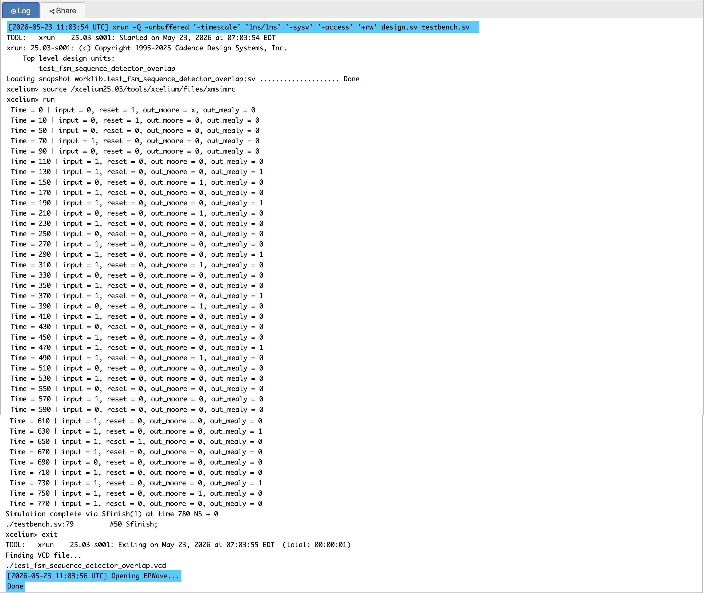
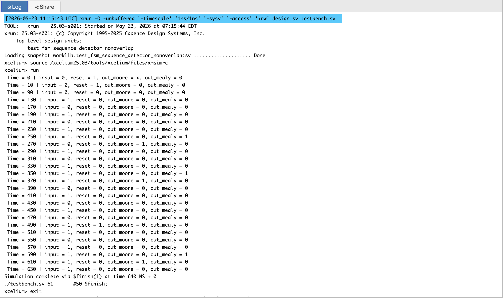
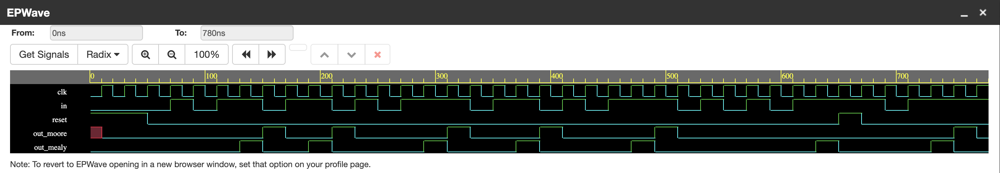
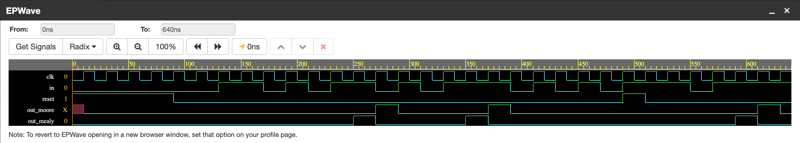

# P05 - FSM Sequence Detector for Pattern `1011`

This project implements a serial sequence detector in Verilog for the
binary pattern `1011`. It compares both Moore and Mealy FSM designs in
overlap and non-overlap modes.

The detector samples one input bit on every positive clock edge. When
the sequence `1011` is detected, the corresponding output becomes high
for one clock cycle.

---

## Designs Implemented

| Design | Output Type | States Used | Detection Style |
|--------|-------------|-------------|-----------------|
| Moore overlap | State based | 5 states | Allows shared bits between detections |
| Moore non-overlap | State based | 5 states | Starts a fresh search after detection |
| Mealy overlap | State and input based | 4 states | Detects on the final input bit and allows overlap |
| Mealy non-overlap | State and input based | 4 states | Detects on the final input bit and restarts |

---

## Project Purpose

The aim of this project is to understand how the same sequence detector
can be designed using different FSM styles. Moore and Mealy machines
solve the same problem, but their output timing and number of states are
different. Overlap and non-overlap logic also change how the FSM behaves
after one sequence has been detected.

This project demonstrates:

- State diagram based FSM design
- Moore and Mealy output generation
- Overlapping and non-overlapping sequence detection
- Two-always-block Verilog coding style
- Testbench based verification using simulation waveforms

---

## Sequence to Detect

Target pattern:

```text
1011
```

Example with overlap:

```text
Input:   1 0 1 1 0 1 1
Pattern: 1 0 1 1
              1 0 1 1
Output:        1     1
```

In overlap mode, the last bit of one detected sequence can become part
of the next sequence. In non-overlap mode, the FSM starts a new search
after completing one detection.

---

## State Meaning

| State | Meaning |
|-------|---------|
| `S` | No valid sequence progress |
| `S1` | Detected `1` |
| `S10` | Detected `10` |
| `S101` | Detected `101` |
| `S1011` | Detected `1011`, Moore output state |

The Mealy machines do not need the `S1011` state because the output is
generated immediately when the FSM is in `S101` and the current input is
`1`.

---

## Moore FSM Design

In a Moore FSM, the output depends only on the current state. For this
reason, the Moore detector uses an extra state, `S1011`, to represent
successful detection.

```verilog
assign out_moore = (curr_state == S1011) ? 1 : 0;
```

This makes the output stable and easy to analyze because it changes only
when the state changes on the clock edge.

### Moore Overlap Transition Table

| Current State | Input `0` | Input `1` | Output |
|---------------|-----------|-----------|--------|
| `S` | `S` | `S1` | 0 |
| `S1` | `S10` | `S1` | 0 |
| `S10` | `S` | `S101` | 0 |
| `S101` | `S10` | `S1011` | 0 |
| `S1011` | `S10` | `S1` | 1 |

### Moore Non-Overlap Transition Table

| Current State | Input `0` | Input `1` | Output |
|---------------|-----------|-----------|--------|
| `S` | `S` | `S1` | 0 |
| `S1` | `S10` | `S` | 0 |
| `S10` | `S` | `S101` | 0 |
| `S101` | `S` | `S1011` | 0 |
| `S1011` | `S` | `S1` | 1 |

---

## Mealy FSM Design

In a Mealy FSM, the output depends on both the current state and the
current input. The Mealy detector asserts the output as soon as the last
bit of `1011` arrives.

```verilog
if (curr_state == S101 && in == 1)
  out_mealy = 1;
```

Because the output is produced during the transition, the Mealy FSM
requires only four states.

### Mealy Overlap Transition Table

| Current State | Input `0` | Input `1` | Output Condition |
|---------------|-----------|-----------|------------------|
| `S` | `S` | `S1` | 0 |
| `S1` | `S10` | `S1` | 0 |
| `S10` | `S` | `S101` | 0 |
| `S101` | `S10` | `S1` | 1 when input is `1` |

### Mealy Non-Overlap Transition Table

| Current State | Input `0` | Input `1` | Output Condition |
|---------------|-----------|-----------|------------------|
| `S` | `S` | `S1` | 0 |
| `S1` | `S10` | `S` | 0 |
| `S10` | `S` | `S101` | 0 |
| `S101` | `S` | `S` | 1 when input is `1` |

---

## Moore vs Mealy Comparison

| Feature | Moore FSM | Mealy FSM |
|---------|-----------|-----------|
| Output depends on | Current state only | Current state and input |
| Number of states | More | Fewer |
| Detection output | After entering detection state | When final bit arrives |
| Output stability | More stable | Faster response |
| Used output signal | `out_moore` | `out_mealy` |

---

## Overlap vs Non-Overlap Comparison

| Feature | Overlap Detector | Non-Overlap Detector |
|---------|------------------|----------------------|
| Bit reuse | Allowed | Not allowed after detection |
| Best for | Continuous stream monitoring | Independent pattern detection |
| Example input | `1011011` gives two detections | Search restarts after each detection |
| FSM behavior | Keeps useful partial match | Clears progress after detection |

---

## Verilog Coding Style

Each FSM uses a two-always-block structure.

The first always block is sequential and updates the current state on
the positive clock edge. Reset sends the FSM back to the idle state.
The sequential block contains only the state register. It responds to
the clock edge and handles reset.

```verilog
always @(posedge clk)
begin
  if (reset)
    curr_state <= S;
  else
    curr_state <= next_state;
end
```

The second always block is combinational and calculates the next state
and output logic. The combinational block contains only the next-state logic. It responds
to any change in current state or input and computes what the next state should be.
Mixing both into one always block cause simulation mismatches, latch
inference during synthesis, and timing analysis problems. This separation keeps the RTL clean, readable, and
synthesis friendly.
The synthesizer converts these two blocks into exactly the hardware they describe —
a register for the state and combinational gates for the transitions.

---

## Testbench Verification

Two testbenches are used:

- `test_fsm_sequence_detector_overlap.v`
- `test_fsm_sequence_detector_nonoverlap.v`

Each testbench instantiates both the Moore and Mealy versions of the
selected detection style, so the output behavior of both FSM types can
be compared directly.

### Overlap Testbench Coverage

**Test 1 — Correct detection of `1011`**  
The testbench applies the target pattern and verifies that both Moore
and Mealy outputs assert on the expected clock cycle.

**Test 2 — Overlapping sequence detection**  
The input stream contains overlapping occurrences of `1011`.
The overlap detector must produce two detections while preserving the
shared bits between patterns.

**Test 3 — False pattern rejection**  
The testbench includes partial and incorrect sequences to confirm that
no output is asserted until the full `1011` pattern is seen.

**Test 4 — Reset during partial match**  
Reset is asserted while the FSM is in a partial-match state. The test
verifies the detector returns to idle and does not produce a false
output.

### Non-Overlap Testbench Coverage

**Test 1 — Correct detection of `1011`**  
The testbench applies the exact sequence and confirms a single detection
on the final bit.

**Test 2 — Non-overlap behavior**  
This test verifies that after one detection the FSM restarts from idle
and does not reuse trailing bits from the previous pattern.

**Test 3 — False pattern rejection**  
Partial and incorrect inputs confirm the non-overlap detector remains
quiet until the full pattern is completed.

**Test 4 — Reset during partial match**  
Reset clears any partial progress and ensures the FSM waits for a new
`1011` sequence.

---

## Simulation Output

### Overlap Simulation



### Non-Overlap Simulation



---

## EPWave Waveforms

### Overlap Waveform



### Non-Overlap Waveform



---

## Files

| File | Description |
|------|-------------|
| `fsm_sequence_detector_moore_overlap.v` | Moore FSM with overlap detection |
| `fsm_sequence_detector_moore_nonoverlap.v` | Moore FSM with non-overlap detection |
| `fsm_sequence_detector_mealy_overlap.v` | Mealy FSM with overlap detection |
| `fsm_sequence_detector_mealy_nonoverlap.v` | Mealy FSM with non-overlap detection |
| `test_fsm_sequence_detector_overlap.v` | Testbench for overlap Moore and Mealy FSMs |
| `test_fsm_sequence_detector_nonoverlap.v` | Testbench for non-overlap Moore and Mealy FSMs |
| `simulation_output_overlap.png` | Console simulation output for overlap test |
| `simulation_output_nonoverlap.png` | Console simulation output for non-overlap test |
| `epwave_waveform_overlap.png` | EPWave waveform for overlap test |
| `epwave_waveform_nonoverlap.png` | EPWave waveform for non-overlap test |

---

## Tools Used

- EDA Playground
- Cadence Xcelium
- EPWave

---

## What I Learned

This project shows how FSM design changes with output style and sequence
handling. Moore design gives a stable state-based output, while Mealy
design gives faster detection with fewer states. Overlap logic preserves
valid partial matches, while non-overlap logic restarts after each
completed sequence. Drawing the state diagram before writing RTL makes
the design easier to implement, simulate.
