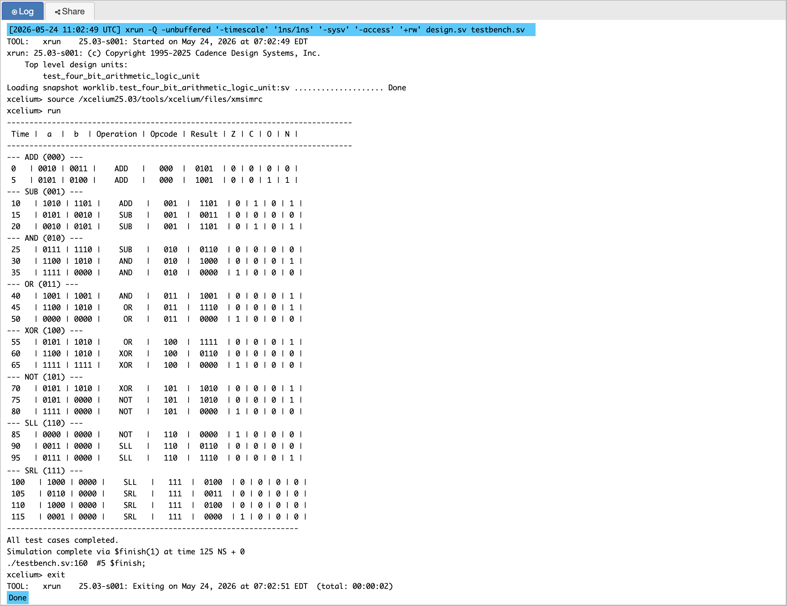
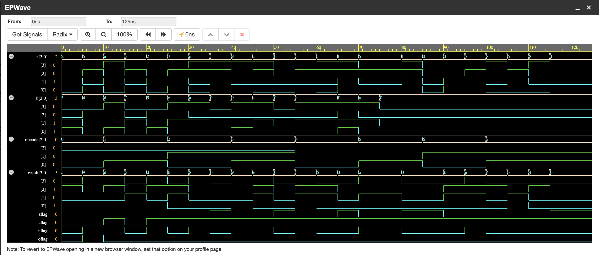

# P06 — 4-Bit Arithmetic Logic Unit (ALU)

A fully combinational 4-bit ALU implementing eight arithmetic and logic
operations with four status flags. This design is the core of the
processor execute stage and demonstrates how a single ALU block can
support both unsigned and signed arithmetic while producing the
control signals needed for conditional branching.

---

## Overview

This ALU accepts two 4-bit operands, `A` and `B`, plus a 3-bit opcode.
It computes all supported operations in parallel and selects the final
result using combinational multiplexing. The design also produces:

- `zflag` — indicates a zero result
- `nflag` — indicates a negative result in two's complement
- `cflag` — indicates carry-out or borrow
- `oflag` — indicates signed overflow

The ALU is useful for both unsigned arithmetic and signed decision logic
in a simple processor datapath.

---

## Supported Operations

| `000` | `ADD` | A + B (unsigned add with carry detection) |
| `001` | `SUB` | A - B (unsigned subtract with borrow and signed overflow detection) |
| `010` | `AND` | Bitwise AND |
| `011` | `OR` | Bitwise OR |
| `100` | `XOR` | Bitwise XOR |
| `101` | `NOT` | Bitwise NOT of A (B is ignored) |
| `110` | `SLL` | Shift left logical A by one bit |
| `111` | `SRL` | Shift right logical A by one bit |

---

## Interface Signals

| Signal | Direction | Width | Description |
|--------|-----------|-------|-------------|
| `A` | Input | 4 bits | First operand |
| `B` | Input | 4 bits | Second operand |
| `opcode` | Input | 3 bits | Selects the operation |
| `result` | Output | 4 bits | ALU output |
| `zflag` | Output | 1 bit | High when result is zero |
| `nflag` | Output | 1 bit | High when result is negative (`result[3]`) |
| `cflag` | Output | 1 bit | Carry-out or borrow indication |
| `oflag` | Output | 1 bit | Signed overflow indication |

---

## Architecture

The ALU is implemented as purely combinational logic:

1. Compute each operation result independently.
2. Generate flags based on the selected result and arithmetic inputs.
3. Use a `case` statement to choose the final `result` according to
   `opcode`.

This structure matches real hardware ALU design, where all operand
functions are available simultaneously and the opcode simply selects
which function result is forwarded.

```
A[3:0]         B[3:0]
  │             │
  ├─ ADD ─┐      ├─ SUB ─┐      ┌────────────┐
  │      │      │      │      │            │
  │      ├─ AND  │      ├─ OR   │            │
  │      │      │      │      ├─ XOR        │
  │      ├─ NOT  │      ├─ SLL  │            │
  │      │      │      │      ├─ SRL        │
  │      │      │      │      │            │
  └──────┴──────┴──────┴──────┴─> 8-to-1 MUX ─> result[3:0]
                                   │
                            zflag, nflag,
                            cflag, oflag
```

---

## Status Flag Behavior

- `zflag` is set when `result == 4'b0000`.
- `nflag` is set when `result[3] == 1`, indicating a negative two's
  complement result.
- `cflag` is set for unsigned carry-out from addition or borrow from
  subtraction.
- `oflag` is set when signed arithmetic overflow occurs.

### Signed Overflow Logic

Signed overflow is detected differently for addition and subtraction.
For addition:

- overflow occurs when two positive operands produce a negative result
- or two negative operands produce a positive result

For subtraction:

- overflow occurs when operands have different signs and the result
  sign does not match the minuend's sign.

Example formulas:

```
oflag_add = (~A[3] & ~B[3] & result[3])
         | ( A[3] &  B[3] & ~result[3]);

oflag_sub = (A[3] ^ B[3]) & (A[3] ^ result[3]);
```
---

## Simulation Output



---

## EPWave Waveform



---

## Test Cases Covered

The testbench covers 24 test cases — 3 cases per operation across
all 8 operations. Each group of 3 cases is designed to test normal
operation, a boundary or flag condition, and a case that exercises
the negative flag specifically.

**Addition tests** cover normal addition with no flags, positive overflow
where two positive numbers produce a negative result in signed arithmetic,
and negative overflow where two negative numbers exceed the minimum value.

**Subtraction tests** cover normal subtraction, subtraction that produces
a negative result demonstrating the negative flag, and subtraction that
causes signed overflow when a positive number subtracts a negative operand.

**AND tests** cover mixed bit patterns, the zero result case that sets
the zero flag, and identical operands that produce a negative result.

**OR tests** cover mixed bit patterns, the all-zero input case that
produces zero, and complementary inputs that produce all ones setting
the negative flag.

**XOR tests** cover mixed bit patterns, identical inputs where XOR
produces zero confirming the zero flag, and inverted inputs that
produce the all-ones negative result.

**NOT tests** cover inverting a positive number to negative, inverting
all ones to zero setting the zero flag, and inverting zero to all ones.

**Shift Left tests** cover normal shifting, shifting a value whose
MSB becomes 1 setting the negative flag, and shifting a value where
all significant bits shift out leaving zero.

**Shift Right tests** cover normal shifting, right-shifting a value
with the MSB set demonstrating logical shift behavior, and shifting
a single 1 bit completely out to zero.

---

## Files

| File | Description |
|------|-------------|
| `four_bit_arithmetic_logic_unit.v` | ALU RTL design |
| `test_four_bit_arithmetic_logic_unit.v` | Testbench covering all operations |

---

## What I Learned

This project reinforces two important RTL design principles:  

- In a combinational ALU, every output must be assigned in every control
  path to avoid unintended latches.
- Flags such as zero, negative, carry, and overflow must be computed from
  the final selected result and from the arithmetic operands, not from
  intermediate partial results.  

Building the ALU helps understand how arithmetic, logic, and condition
flags are combined in a processor datapath — the exact same patterns are
used in real CPU execute stages.
  
The overflow detection logic revealed that signed and unsigned arithmetic
produce different notions of error — carry captures unsigned overflow
while the dedicated overflow flag captures signed overflow. Understanding
this distinction is essential for implementing signed comparisons and
conditional branches in the RISC-V processor.

---

## Tools Used

- EDA Playground — online Verilog simulator
- Cadence Xcelium — simulation engine
- EPWave — waveform viewer
